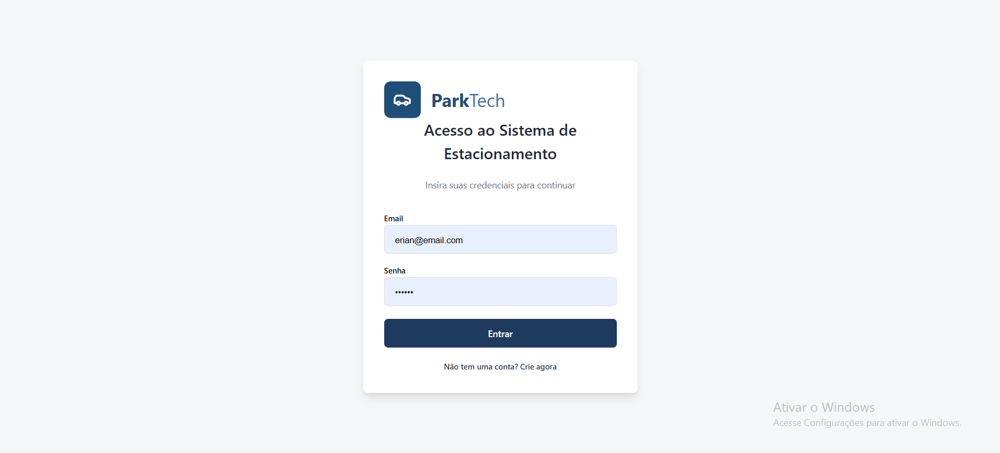
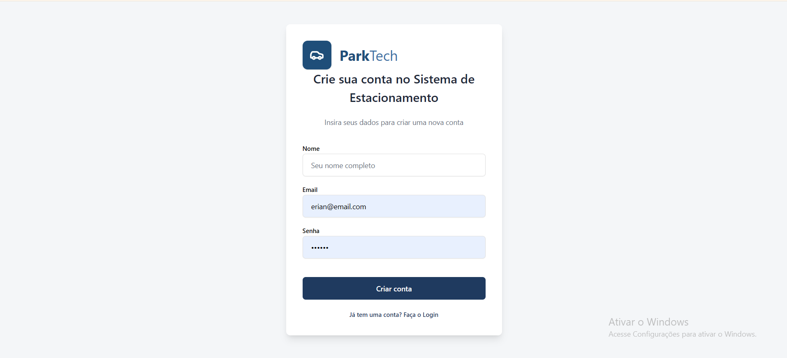
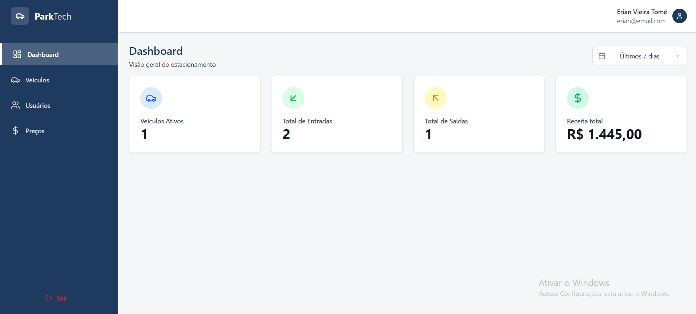
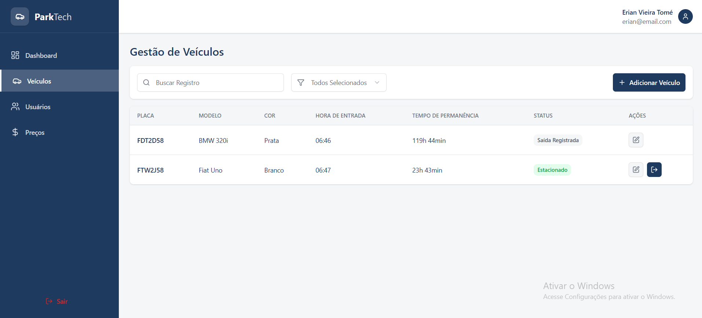
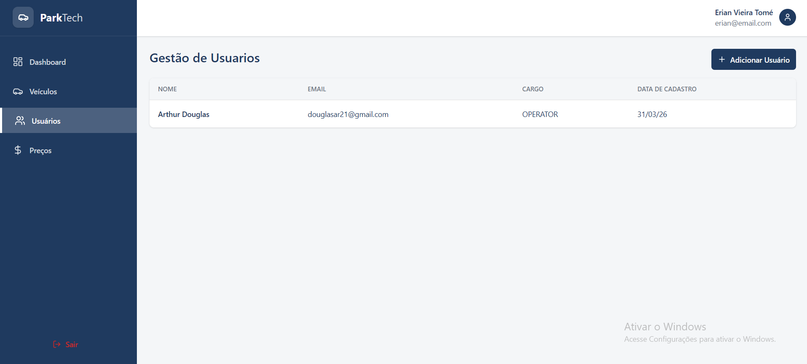
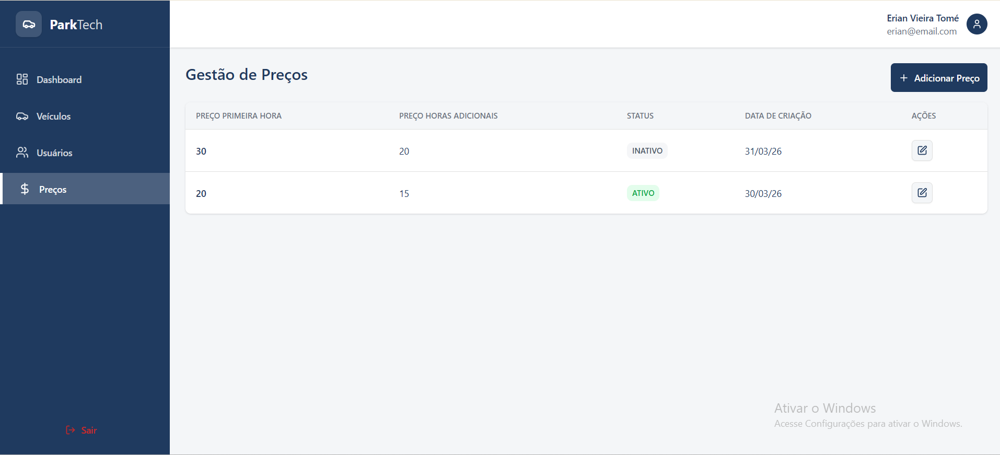

# Projeto ParkTech

Apresento a vocês um projeto no qual eu desenvolvi juntamento com apoio do meu curso de programação; fico feliz com a conclusão desse projeto que foi desafiador pra mim.

Consiste em um Sistema para Gerenciar um Estacionamento; desenvolvi tanto o BackEnd quanto o FrontEnd
E uma aplicação de uma pagina deixando projeto mais rapido 

Aqui no FrontEnd as técnologias utilizadas foram:
- React
- Vite
- Typescrypt
- TailwindCSS
- React Router Dom
- Shadcn
- Zod
- React Hook Form

## Imagens do Projeto 

    
    
    
    
    
       

